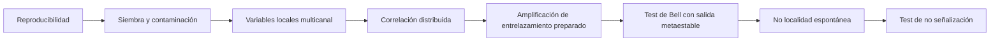

# Metastable Nucleation Suite

[](https://github.com/Papishushi/metastable-nucleation-suite/actions/workflows/ci.yml)
[](LICENSE)
[](LICENSE-DOCS)

Suite abierta de protocolos, modelos de referencia y diseño experimental para estudiar **nucleación, metaestabilidad, selección de polimorfos, contaminación por semillas, variables ambientales latentes, retroacción de medida y posibles correlaciones no locales**.

El repositorio separa explícitamente tres cosas que suelen mezclarse:

1. **Fenómenos establecidos:** nucleación estocástica, barreras de energía libre, nucleación heterogénea, siembra, polimorfismo, decoherencia y correlaciones de Bell en sistemas preparados.
2. **Hipótesis plausibles pero no demostradas:** variables ambientales conocidas combinadas no linealmente, perturbaciones físicas compartidas o sensibilidad extrema de la nucleación a microcondiciones no registradas.
3. **Hipótesis extraordinarias:** correlaciones Bell-no-locales espontáneas entre sistemas preparados independientemente, violación de no señalización o acoplamientos no descritos por la física estándar.

> **Posición científica de partida:** la física conocida predice que dos sistemas independientes, sin entrelazamiento ni canal causal compartido, no violarán Bell y no permitirán señalización superlumínica. Una coincidencia temporal o una correlación residual no basta para demostrar no localidad.

## Qué contiene

- `docs/01_marco_cientifico.md`: términos, supuestos y límites.
- `docs/02_matriz_hipotesis.md`: hipótesis ordenadas desde química ordinaria hasta nueva física.
- `docs/03_suite_experimentos.md`: desarrollo científico de los 15 experimentos.
- `docs/04_laboratorio_metaestados_opticos.md`: diseño conceptual del laboratorio óptico distribuido.
- `docs/05_estadistica_y_falsacion.md`: análisis preregistrado, Bell, no señalización y control de multiplicidad.
- `docs/06_hoja_de_ruta.md`: fases de implementación y criterios go/no-go.
- `docs/07_seguridad_y_limites.md`: seguridad láser, criogenia, vacío y límites epistemológicos.
- `docs/09_fuentes_por_experimento.md`: trazabilidad de cada protocolo a literatura primaria.
- `docs/10_plantilla_preregistro.md`: preregistro para análisis confirmatorios.
- `docs/11_contrato_de_datos.md`: formato común de eventos, tiempos, flags y metrología.
- `docs/12_matriz_de_fallos_y_lagunas.md`: amenazas experimentales, falsos positivos y mitigaciones.
- `docs/13_ontologia_semantica.md`: arquitectura TBox/ABox, validación SHACL y uso por agentes.
- `docs/14_motor_ejecucion_hardware_y_potencia.md`: ejecución semántica, adaptadores y potencia Monte Carlo.
- `references.bib`: bibliografía primaria y revisiones verificables por DOI.
- `experiments/catalog.yaml`: índice resumido legible por máquina.
- `experiments/specifications.yaml`: especificaciones ejecutables de E01–E15, con hipótesis nula, controles, exclusiones, parada y análisis.
- `experiments/specifications.schema.json`: contrato formal de las especificaciones.
- `ontology/tbox.ttl`: ontología OWL del dominio científico.
- `ontology/execution-extension.ttl`: campañas, backends, datasets y análisis de potencia.
- `ontology/abox-shapes.ttl`: contrato SHACL base.
- `ontology/execution-shapes.ttl`: shapes para planes, ejecuciones, datasets y campañas.
- `ontology/abox.schema.json`: JSON Schema para documentos ABox en JSON-LD.
- `ontology/context.jsonld`: contexto JSON-LD reutilizable.
- `ontology/queries/`: biblioteca de consultas SPARQL para humanos y agentes.
- `schemas/event.schema.json`: contrato de datos evento a evento.
- `src/metastable_suite/hardware.py`: interfaz común de backends físicos y simulados.
- `src/metastable_suite/execution.py`: motor de ejecución semántico.
- `src/metastable_suite/monte_carlo_power.py`: potencia empírica mediante simulación.
- `scripts/semantic_execute.py`: ejecución de ABoxes `Planned`.
- `scripts/monte_carlo_power.py`: CLI de potencia Monte Carlo.
- `tests/`: pruebas matemáticas, estadísticas, bibliográficas, adversariales, semánticas y de hardware.

## Inicio rápido

```bash
python -m venv .venv
source .venv/bin/activate        # Windows: .venv\Scripts\activate
pip install -e .[dev]
make check
```

La comprobación completa valida catálogo, especificaciones, bibliografía, ontología, ABoxes, backends, datasets, potencia y ejecución de referencia.

### Ejecutar un plan ontológico

```bash
python scripts/semantic_execute.py \
  ontology/examples/planned-e09.jsonld \
  artifacts/execution
```

El motor valida la ABox `Planned`, materializa la configuración, ejecuta el backend, escribe eventos NDJSON con SHA-256 y genera una ABox `Completed` que vuelve a pasar SHACL.

### Materializar un informe agregado

```bash
python scripts/run_suite.py --trials 200000 --seed 7
python scripts/semantic_graph.py from-report \
  artifacts/reference_report.json \
  artifacts/reference_run.jsonld \
  --run-id reference-seed-7
```

### Consultar mediante SPARQL

```bash
python scripts/semantic_graph.py query \
  artifacts/reference_run.jsonld \
  ontology/queries/completed-runs.rq
```

### Potencia analítica y Monte Carlo

```bash
python scripts/plan_experiment.py --experiment chsh --target-s 2.4 --alpha 0.001 --power 0.90
python scripts/monte_carlo_power.py \
  --design chsh \
  --sample-size 10000 \
  --visibility 0.95 \
  --loss-by-setting 0.10 \
  --alpha 0.001 \
  --repetitions 2000
```

La aproximación analítica sirve para órdenes de magnitud. Monte Carlo permite introducir memoria, pérdida dependiente del ajuste, multiplicidad y parámetros específicos del dispositivo.

## Qué comprueba el software

El simulador no pretende modelar un dispositivo concreto con precisión microscópica. Sirve para comprobar que la canalización estadística distingue correctamente nucleación Poisson local, sesgo por semillas, causa común clásica, modelos locales de Bell, benchmarks cuánticos, no señalización y bifurcaciones ópticas con ruido local.

La suite adversarial añade mecanismos que pueden fabricar descubrimientos aparentes: deriva compartida, modulación de reloj, memoria entre ensayos y pérdidas dependientes del ajuste. Los tests deben demostrar que esos mecanismos son detectables y que los controles reducen la señal espuria.

Los backends físicos y simulados comparten el mismo ciclo de vida. Los fallos no se descartan silenciosamente: se conservan como ensayos inválidos con motivos de exclusión auditables. RDF representa significado y procedencia; NDJSON conserva el volumen de eventos; el manifiesto enlaza ambos mediante hash criptográfico.

## Principio de diseño



No se salta al último peldaño porque una correlación misteriosa casi siempre resulta ser un cable, un reloj compartido, una selección posterior de datos o un sesgo del detector. La física tiene sentido del humor, pero suele ser de laboratorio: el “fenómeno cósmico” era el aire acondicionado.

## Estado del proyecto

Diseño conceptual, software de referencia y motor de ejecución semántico. **No afirma que exista no localidad espontánea en la nucleación.** Define cómo intentar refutar primero las explicaciones ordinarias y qué observación sería realmente extraordinaria.

## Licencia

Código bajo MIT. Documentación bajo CC BY 4.0; véase `LICENSE` y `LICENSE-DOCS`.

## Contribuciones experimentales

Las propuestas nuevas deben declarar hipótesis, predicción nula, controles, confundidores, criterio de escalado y fuentes primarias. GitHub incluye plantillas específicas para propuestas experimentales y fallos reproducibles.
