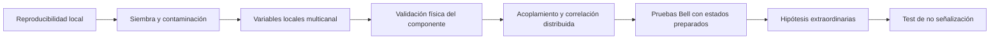

# Metastable Nucleation Suite

[](https://github.com/Papishushi/metastable-nucleation-suite/releases)
[](https://doi.org/10.5281/zenodo.21387011)
[](https://github.com/Papishushi/metastable-nucleation-suite/actions/workflows/ci.yml)
[](https://github.com/Papishushi/metastable-nucleation-suite/actions/workflows/references.yml)
[](LICENSE)
[](LICENSE-DOCS)
[](https://github.com/Papishushi/metastable-nucleation-suite/issues/74)

**Metastable Nucleation Suite (MNS)** es una plataforma abierta de protocolos, contratos de datos, modelos de referencia y ejecución reproducible para investigar nucleación, metaestabilidad y selección de estados físicos.

El repositorio combina diseño experimental, estadística adversarial, procedencia semántica, integración de hardware, visualización científica y operación distribuida. Su objetivo no es convertir una hipótesis en cierta mediante software, sino hacer explícito qué se ha observado, qué se ha inferido, qué se ha simulado y qué tendría que ocurrir para aceptar o descartar una afirmación.

> **Posición científica:** MNS no afirma haber demostrado no localidad espontánea, una arquitectura computacional superior ni un dispositivo Nucleation-Encoded Chalcogenide Ensemble. Las hipótesis extraordinarias permanecen separadas de los resultados establecidos y de las simulaciones.

## Programas científicos

La arquitectura general de MNS se organiza en dos programas coiguales:

1. **Materia, nucleación y polimorfismo**: selección de fases, dominios, memoria, contaminación por semillas, ferroicos, sistemas magnéticos, iónicos, mecánicos y vítreos.
2. **Metaestados fotónicos y física fundamental**: sistemas ópticos, electromagnéticos, polaritónicos, colectivos y fuera del equilibrio, incluidas pruebas de correlación y no señalización con controles explícitos.

Ningún programa es una capa auxiliar del otro. La arquitectura, el **Metastate Atlas** y la investigación sobre circuitería definida por nucleación se siguen en [#63](https://github.com/Papishushi/metastable-nucleation-suite/issues/63) y [#64](https://github.com/Papishushi/metastable-nucleation-suite/issues/64).

El **Nucleation-Encoded Chalcogenide Ensemble (NECE)** es una rama material específica, no otro nombre para MNS. Su definición, falsificación y programa experimental se siguen en [#50](https://github.com/Papishushi/metastable-nucleation-suite/issues/50).

## Estado real del proyecto

| Área | Estado |
|---|---|
| Protocolos E01–E15, modelos de referencia y pruebas adversariales | Implementados y verificables por software |
| Contratos JSON/JSON-LD, ontología OWL, SHACL y procedencia | Implementados |
| Backends simulados, Serial, TCP y VISA | Implementados |
| Control plane Kestrel, Extend0 y MetaDB | Implementado como capa operativa opcional |
| CLI y artefactos autocontenidos para Windows, Linux y macOS | Publicados mediante releases |
| Imágenes OCI multi-arquitectura, SBOM y attestations | Automatizados en el pipeline de release |
| Visualizador Rust/WASM | En desarrollo; los límites de validación y procedencia existen antes del renderizado completo |
| Validación física Stage 1 | Pendiente; no debe confundirse con CI o simulación |
| Arquitectura general Metastate Atlas | Borrador científico en PR [#59](https://github.com/Papishushi/metastable-nucleation-suite/pull/59) |
| Modelos escalares y NECE | Borradores científicos en PR [#60](https://github.com/Papishushi/metastable-nucleation-suite/pull/60), [#61](https://github.com/Papishushi/metastable-nucleation-suite/pull/61) y [#62](https://github.com/Papishushi/metastable-nucleation-suite/pull/62); no forman parte de la release estable mientras sigan abiertos |

Una comprobación verde significa que el código es coherente con sus contratos y tests. No equivale a observación experimental, revisión científica independiente ni replicación.

## Capacidades actuales

- Catálogo y especificaciones ejecutables de E01–E15.
- Simulación de nucleación local, siembra, causa común, modelos locales de Bell, referencias cuánticas, no señalización y bifurcación óptica.
- Escenarios adversariales con deriva compartida, memoria, modulación temporal, pérdidas dependientes del ajuste y selección problemática.
- Planificación analítica y Monte Carlo de potencia estadística.
- Ejecución semántica desde ABoxes `Planned` hasta artefactos `Completed` validados mediante SHACL.
- Registro NDJSON de eventos, hashes SHA-256 y procedencia RDF/JSON-LD.
- Adaptadores de hardware con semántica explícita de timeout, desconexión, error de protocolo y ensayo inválido.
- Control plane distribuido opcional con estados durables, recuperación y orquestación cross-process.
- Contrato de escena 3D que separa observaciones medidas, geometría derivada, abstracciones e incertidumbre.
- Releases reproducibles con binarios autocontenidos, paquetes Python, imágenes OCI, SBOM, checksums y attestations.

## Instalación

Para utilizar una release sin clonar el repositorio, consulta [INSTALL.md](INSTALL.md) y la página de [releases](https://github.com/Papishushi/metastable-nucleation-suite/releases).

Para desarrollo:

```bash
python -m venv .venv
source .venv/bin/activate        # Windows: .venv\Scripts\activate
pip install -e .[dev]
make check
```

Para conectar hardware Serial o VISA:

```bash
pip install -e .[hardware]
```

TCP no requiere dependencias adicionales.

## Citación, archivado y preprints

- [Zenodo DOI `10.5281/zenodo.21387011`](https://doi.org/10.5281/zenodo.21387011) es el identificador persistente actualmente disponible para el registro archivado de MNS.
- [`CITATION.cff`](CITATION.cff) es la fuente canónica de metadatos de citación y de ingestión de releases en Zenodo.
- [#104](https://github.com/Papishushi/metastable-nucleation-suite/issues/104) sigue la verificación del tipo de registro, los DOI complementarios y los enlaces cruzados de Zenodo.
- [#105](https://github.com/Papishushi/metastable-nucleation-suite/issues/105) sigue el manuscrito reproducible y la entrega manual del preprint a arXiv.
- [El workflow Zenodo/arXiv](docs/20_zenodo_arxiv_archiving_workflow.md) define identificadores, higiene de fuentes y enlaces cruzados.
- [#103](https://github.com/Papishushi/metastable-nucleation-suite/issues/103) coordina archivado, preprint, software paper y difusión.

El DOI anterior hace citable el registro archivado asociado. Su clasificación como DOI de versión o DOI conceptual, y cualquier DOI complementario, se documentarán en #104 después de verificar los metadatos del registro. Un DOI o un identificador arXiv no demuestra una hipótesis física ni sustituye revisión por pares o replicación.

## Contribuir o revisar sin aprender todo el repositorio

- [ONBOARDING.md](ONBOARDING.md): ruta de 30 minutos y carriles por perfil.
- [Mapa de arquitectura y contribución](docs/18_architecture_and_contribution_map.md): qué capa modifica cada tipo de cambio.
- [CONTRIBUTING.md](CONTRIBUTING.md): PBIs, criterios científicos y validación de PRs.
- [REVIEWING.md](REVIEWING.md): revisión crítica focalizada, incluida una conclusión no-go.
- [Issue #93](https://github.com/Papishushi/metastable-nucleation-suite/issues/93): preguntas de instalación y asignación de una primera tarea acotada.
- [Issue #74](https://github.com/Papishushi/metastable-nucleation-suite/issues/74): llamada a revisores científicos y técnicos independientes.
- [CODE_OF_CONDUCT.md](CODE_OF_CONDUCT.md) y [SECURITY.md](SECURITY.md): convivencia y reporte privado de vulnerabilidades.

No es necesario dominar Python, .NET, Rust, semántica y hardware a la vez. Elige una frontera concreta, enlaza una issue y valida únicamente las capas afectadas sin debilitar `make check`.

## Flujo científico reproducible

### Ejecutar un plan ontológico

```bash
python scripts/semantic_execute.py \
  ontology/examples/planned-e09.jsonld \
  artifacts/execution
```

El motor valida la ABox `Planned`, materializa la configuración, ejecuta el backend, conserva eventos NDJSON y genera una ABox `Completed` que vuelve a pasar SHACL.

### Materializar un informe agregado

```bash
python scripts/run_suite.py --trials 200000 --seed 7
python scripts/semantic_graph.py from-report \
  artifacts/reference_report.json \
  artifacts/reference_run.jsonld \
  --run-id reference-seed-7
```

### Consultar mediante SPARQL

```bash
python scripts/semantic_graph.py query \
  artifacts/reference_run.jsonld \
  ontology/queries/completed-runs.rq
```

### Potencia analítica y Monte Carlo

```bash
python scripts/plan_experiment.py \
  --experiment chsh \
  --target-s 2.4 \
  --alpha 0.001 \
  --power 0.90

python scripts/monte_carlo_power.py \
  --design chsh \
  --sample-size 10000 \
  --visibility 0.95 \
  --loss-by-setting 0.10 \
  --alpha 0.001 \
  --repetitions 2000
```

La aproximación analítica sirve para órdenes de magnitud. Monte Carlo permite introducir memoria, pérdida dependiente del ajuste, multiplicidad y parámetros específicos del dispositivo.

## Capa operativa .NET

### Diagnóstico de Extend0

```bash
dotnet run --project dotnet/Metastable.Platform.Cli -- extend0 doctor
```

El comando verifica la versión cargada y la creación del gestor local mediante la fachada pública de MetaDB. Los artefactos científicos, ABoxes y datasets siguen siendo la fuente de verdad; Extend0 coordina ejecución y metadatos operativos según [ADR 0003](docs/adr/0003-extend0-operational-integration.md).

### Control plane distribuido

```bash
docker compose --profile distributed up --build --wait control-plane
```

La API Kestrel queda disponible en `http://127.0.0.1:8080`. Su contrato, recuperación y límites están documentados en [docs/17_control_plane.md](docs/17_control_plane.md).

## Estructura del repositorio

### Ciencia y protocolos

- [docs/01_marco_cientifico.md](docs/01_marco_cientifico.md): términos, supuestos y límites.
- [docs/02_matriz_hipotesis.md](docs/02_matriz_hipotesis.md): hipótesis desde química ordinaria hasta nueva física.
- [docs/03_suite_experimentos.md](docs/03_suite_experimentos.md): desarrollo científico de E01–E15.
- [docs/04_laboratorio_metaestados_opticos.md](docs/04_laboratorio_metaestados_opticos.md): laboratorio óptico distribuido.
- [docs/05_estadistica_y_falsacion.md](docs/05_estadistica_y_falsacion.md): preregistro, Bell, no señalización y multiplicidad.
- [docs/06_hoja_de_ruta.md](docs/06_hoja_de_ruta.md): fases y criterios go/no-go.
- [docs/07_seguridad_y_limites.md](docs/07_seguridad_y_limites.md): seguridad y límites epistemológicos.
- [docs/09_fuentes_por_experimento.md](docs/09_fuentes_por_experimento.md): trazabilidad a literatura primaria.
- [docs/10_plantilla_preregistro.md](docs/10_plantilla_preregistro.md): plantilla confirmatoria.
- [docs/12_matriz_de_fallos_y_lagunas.md](docs/12_matriz_de_fallos_y_lagunas.md): amenazas y falsos positivos.
- [docs/19_community_outreach_and_publication_plan.md](docs/19_community_outreach_and_publication_plan.md): captación, revisión y publicación de software.
- [docs/20_zenodo_arxiv_archiving_workflow.md](docs/20_zenodo_arxiv_archiving_workflow.md): DOI de releases, preprint y enlaces persistentes.

### Datos, semántica y ejecución

- `experiments/catalog.yaml` y `experiments/specifications.yaml`.
- `schemas/` y `contracts/v1/`.
- `ontology/`: TBox, shapes, contexto JSON-LD, ejemplos y consultas SPARQL.
- [docs/11_contrato_de_datos.md](docs/11_contrato_de_datos.md).
- [docs/13_ontologia_semantica.md](docs/13_ontologia_semantica.md).
- [docs/14_motor_ejecucion_hardware_y_potencia.md](docs/14_motor_ejecucion_hardware_y_potencia.md).
- [docs/15_adaptadores_hardware.md](docs/15_adaptadores_hardware.md).
- [docs/17_control_plane.md](docs/17_control_plane.md).
- [docs/18_architecture_and_contribution_map.md](docs/18_architecture_and_contribution_map.md).

### Implementación

- `src/metastable_suite/`: modelos, análisis y ejecución Python.
- `dotnet/`: CLI y control plane .NET.
- `visualizer/`: núcleo Rust/WASM WebGPU con fallback WebGL2.
- `deploy/` y `compose.yaml`: despliegue reproducible.
- `tests/`: pruebas matemáticas, estadísticas, bibliográficas, semánticas, de hardware y release.
- `references.bib`: bibliografía DOI verificada por CI.

## Evidencia, gates y revisión

El gate de validación física sigue la dependencia de cada afirmación; no bloquea por número de experimento ni permite que una plataforma herede evidencia de otra. Véase [#66](https://github.com/Papishushi/metastable-nucleation-suite/issues/66).

MNS separa origen de evidencia, protocolo, revisión, replicación y alcance de la afirmación. El trabajo para hacer esos metadatos verificables se sigue en [#70](https://github.com/Papishushi/metastable-nucleation-suite/issues/70) y [#77](https://github.com/Papishushi/metastable-nucleation-suite/issues/77).

Las revisiones críticas y recomendaciones no-go son bienvenidas. Consulta [REVIEWING.md](REVIEWING.md) y la llamada abierta [#74](https://github.com/Papishushi/metastable-nucleation-suite/issues/74).

## Roadmap principal

- [#37](https://github.com/Papishushi/metastable-nucleation-suite/issues/37): validación física de un nodo.
- [#41](https://github.com/Papishushi/metastable-nucleation-suite/issues/41): visualización científica 3D.
- [#50](https://github.com/Papishushi/metastable-nucleation-suite/issues/50): programa experimental NECE.
- [#63](https://github.com/Papishushi/metastable-nucleation-suite/issues/63): programas generales de MNS y Metastate Atlas.
- [#72](https://github.com/Papishushi/metastable-nucleation-suite/issues/72): gobernanza y dependencias.
- [#76](https://github.com/Papishushi/metastable-nucleation-suite/issues/76): comparación entre plataformas y arquitecturas híbridas.
- [#103](https://github.com/Papishushi/metastable-nucleation-suite/issues/103): publicación, Zenodo, arXiv y captación de colaboradores.

## Principio de escalado experimental



No se salta al último peldaño porque una correlación misteriosa suele ser deriva, reloj compartido, selección posterior, contaminación, cross-talk o sesgo del detector antes que nueva física.

## Licencias

Código bajo MIT. Documentación bajo CC BY 4.0; véase [LICENSE](LICENSE) y [LICENSE-DOCS](LICENSE-DOCS).

## Contribuciones

Las propuestas nuevas deben declarar hipótesis, predicción nula, controles, confundidores, criterio de escalado, evidencia requerida y fuentes primarias. GitHub incluye plantillas para propuestas experimentales, PBIs, onboarding y fallos reproducibles.
