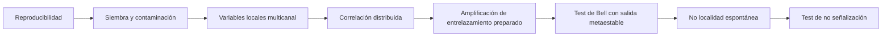

# Metastable Nucleation Suite

Suite abierta de protocolos, modelos de referencia y diseño experimental para estudiar **nucleación, metaestabilidad, selección de polimorfos, contaminación por semillas, variables ambientales latentes, retroacción de medida y posibles correlaciones no locales**.

El repositorio separa explícitamente tres cosas que suelen mezclarse:

1. **Fenómenos establecidos:** nucleación estocástica, barreras de energía libre, nucleación heterogénea, siembra, polimorfismo, decoherencia y correlaciones de Bell en sistemas preparados.
2. **Hipótesis plausibles pero no demostradas:** variables ambientales conocidas combinadas no linealmente, perturbaciones físicas compartidas o sensibilidad extrema de la nucleación a microcondiciones no registradas.
3. **Hipótesis extraordinarias:** correlaciones Bell-no-locales espontáneas entre sistemas preparados independientemente, violación de no señalización o acoplamientos no descritos por la física estándar.

> **Posición científica de partida:** la física conocida predice que dos sistemas independientes, sin entrelazamiento ni canal causal compartido, no violarán Bell y no permitirán señalización superlumínica. Una coincidencia temporal o una correlación residual no basta para demostrar no localidad.

## Qué contiene

- `docs/01_marco_cientifico.md`: términos, supuestos y límites.
- `docs/02_matriz_hipotesis.md`: hipótesis ordenadas desde química ordinaria hasta nueva física.
- `docs/03_suite_experimentos.md`: 15 experimentos con controles, métricas y resultado esperado.
- `docs/04_laboratorio_metaestados_opticos.md`: diseño conceptual del laboratorio óptico distribuido.
- `docs/05_estadistica_y_falsacion.md`: análisis preregistrado, Bell, no señalización y control de multiplicidad.
- `docs/06_hoja_de_ruta.md`: fases de implementación y criterios go/no-go.
- `docs/07_seguridad_y_limites.md`: seguridad láser, criogenia, vacío y límites epistemológicos.
- `docs/09_fuentes_por_experimento.md`: trazabilidad de cada protocolo a literatura primaria.
- `references.bib`: bibliografía primaria y revisiones.
- `experiments/catalog.yaml`: catálogo estructurado legible por máquina.
- `src/metastable_suite/`: simuladores de resultados nulos y benchmarks cuánticos.
- `scripts/run_suite.py`: ejecuta los modelos de referencia y genera un informe JSON.
- `tests/`: pruebas de consistencia matemática y estadística.

## Inicio rápido

```bash
python -m venv .venv
source .venv/bin/activate        # Windows: .venv\\Scripts\\activate
pip install -e .[dev]
python scripts/run_suite.py --trials 200000 --seed 7
pytest
```

El simulador no pretende modelar un dispositivo concreto con precisión microscópica. Sirve para comprobar que la canalización estadística distingue correctamente:

- nucleación Poisson local;
- sesgo por semillas;
- causa común clásica;
- modelo local de Bell, con `|S| <= 2` salvo fluctuación finita;
- benchmark cuántico ideal, con `S ≈ 2√2`;
- ausencia de señalización en los marginales;
- bifurcación óptica metaestable con ruido local.

## Principio de diseño

La suite aplica una escalera de evidencia:



No se salta al último peldaño porque una correlación misteriosa casi siempre resulta ser un cable, un reloj compartido, una selección posterior de datos o un sesgo del detector. La física tiene sentido del humor, pero suele ser de laboratorio: el “fenómeno cósmico” era el aire acondicionado.

## Estado del proyecto

Diseño conceptual y software de referencia. **No afirma que exista no localidad espontánea en la nucleación.** Define cómo intentar refutar primero las explicaciones ordinarias y qué observación sería realmente extraordinaria.

## Licencia

Código bajo MIT. Documentación bajo CC BY 4.0; véase `LICENSE` y `LICENSE-DOCS`.
