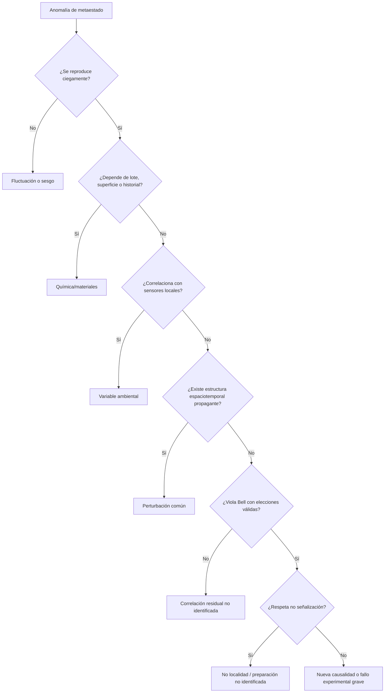

# 2. Matriz de hipótesis

| ID | Hipótesis | Clase | Predicción principal | Evidencia mínima | Prioridad previa |
|---|---|---|---|---|---|
| H0 | Nucleación local estocástica condicionada por variables conocidas | Estándar | Tiempos compatibles con un proceso de riesgo local; nodos independientes tras condicionar | Replicación y ajuste de supervivencia | Muy alta |
| H1 | Semillas o superficies cambian selectivamente la barrera | Estándar | Curva dosis-respuesta, memoria de exposición y transferencia material | Muestreo de superficies, blancos, descontaminación | Muy alta |
| H2 | Microvariables locales omitidas | Estándar | Correlación con sensores, lote, operario, recipiente o historial | Modelo jerárquico multicanal | Muy alta |
| H3 | Combinación no lineal de variables conocidas | Estándar/plausible | El efecto emerge en interacciones y umbrales, no en variables aisladas | Predicción fuera de muestra | Alta |
| H4 | Perturbación física común propagante | Plausible | Retardos compatibles con dirección y velocidad finita | Red multinodo sincronizada | Media |
| H5 | Retroacción de la medición selecciona el estado | Estándar | Dependencia con fuerza, momento y modalidad de lectura | Ensayo aleatorizado de instrumentación | Alta |
| H6 | Entrelazamiento preparado se amplifica a una salida metaestable | Cuántica estándar | Bell puede violarse si la fidelidad total supera el umbral | Fuente entrelazada + salida binaria eficiente | Media |
| H7 | La nucleación óptica crea correlaciones Bell sin fuente común | Extraordinaria | `|S| > 2` robusto en nodos independientes | Test sin lagunas relevantes y replicado | Muy baja |
| H8 | Dependencia remota controlable de los marginales | Fuera del estándar | Violación de no señalización | Modulación remota preregistrada, ciega y causalmente aislada | Extremadamente baja |
| H9 | Canal gravitacional cuántico genera entrelazamiento | Investigación activa | Testigo de entrelazamiento bajo acoplamiento gravitatorio | Masas cuánticas coherentes y control de EM | Muy baja/tecnología futura |
| H10 | Un “campo oculto” modifica nucleación | Incompleta sin modelo | Debe predecir amplitud, simetría, acoplamiento y propagación | Señal independiente en sensores o predicción falsable | No asignable |

## Regla de parsimonia

No se compara “una semilla complicada” contra “un campo sencillo” por el número de palabras. Un campo físico añade grados de libertad, ecuación dinámica, acoplamiento, simetrías y restricciones experimentales. La explicación más parsimoniosa es la que comprime más datos con menos parámetros efectivos y mejores predicciones fuera de muestra.

## Jerarquía de decisión

