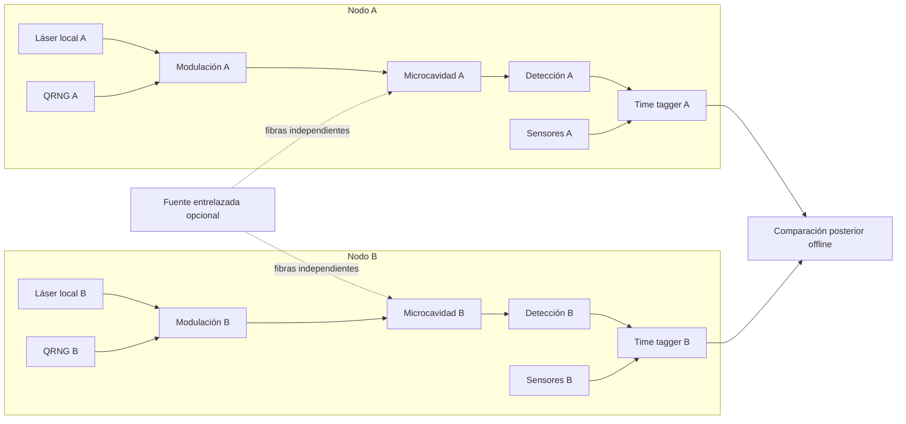

# 4. Laboratorio de metaestados ópticos

## 4.1 Objetivo

Construir dos nodos ópticos físicamente independientes capaces de:

1. preparar repetidamente un estado inicial simétrico;
2. cruzar una bifurcación hacia dos atractores metaestables;
3. fijar y leer el resultado en picosegundos–nanosegundos;
4. variar localmente el Hamiltoniano o la base de medida;
5. registrar cada ensayo con trazabilidad completa;
6. operar tanto con entradas separables como entrelazadas.

La plataforma recomendada para el primer laboratorio es una **microcavidad polaritónica**. Una alternativa de mayor pureza cuántica y menor madurez instrumental es un medio de **polaritones de Rydberg**.

## 4.2 Por qué polaritones

Los fotones desnudos son fáciles de transportar y medir, pero interactúan débilmente. Los electrones interactúan con fuerza, pero están muy expuestos al entorno sólido. El polaritón combina:

- componente fotónica: lectura rápida, fase, polarización y propagación;
- componente material: no linealidad, masa efectiva e interacción;
- dinámica disipativa: atractores, biestabilidad, vórtices y ruptura espontánea de simetría.

No es “luz pura”. Esa impureza conceptual es precisamente lo que permite que haya metaconfiguraciones.

## 4.3 Arquitectura de dos nodos



Durante E09, E12 y E13 no debe existir enlace activo entre controladores. La sincronización se realiza con relojes locales disciplinados antes del ensayo y se reconstruye después.

## 4.4 Subconjuntos hardware

### A. Fuente y control ultrarrápido

- láser pulsado de femtosegundos o picosegundos por nodo;
- oscilador y electrónica de disparo independientes;
- moduladores electroópticos para base/polarización;
- AOM para amplitud y gating;
- estabilización local de frecuencia, sin referencia compartida durante la ventana de localidad;
- aisladores ópticos y monitor de retroreflexión.

### B. Dispositivo metaestable

Opción 1, prioritaria:

- microcavidad semiconductora de alta Q;
- pozos cuánticos o material excitónico;
- criostato de ciclo cerrado si el material lo exige;
- control piezoeléctrico/temperatura de detuning;
- geometría que soporte dos estados degenerados: espín ±, vórtice ± o modos A/B.

Opción 2:

- nube atómica fría bajo EIT;
- excitación Rydberg para interacción fotón–fotón;
- cavidad o guía de onda;
- mayor aislamiento y complejidad, pero acceso a pocos cuantos.

### C. Detección

- SNSPD o detectores equivalentes para conteo y bajo jitter;
- fotodiodos balanceados para homodino/heterodino;
- cámara de streak o interferometría ultrarrápida para formación de dominio;
- espectrómetro y polarimetría;
- time tagger con resolución mejor que la ventana física de decisión;
- rama de monitorización de energía por pulso.

### D. Entorno y metrología

Cada nodo registra, en reloj local:

- temperatura de cavidad y bancada;
- vibración triaxial y acústica;
- campos eléctricos y magnéticos;
- RF de banda ancha;
- presión, humedad y vacío;
- radiación ionizante;
- potencia, espectro, fase y polarización de bombeo;
- estado de criocooler, bombas y fuentes;
- hashes de firmware, configuración y código.

### E. Independencia física

- alimentación separada o aislada y registrada;
- sin red común durante ensayos críticos;
- láseres, generadores, relojes y QRNG distintos;
- fibra de la fuente entrelazada solo en E10/E11;
- blindaje electromagnético caracterizado, no asumido;
- distancia suficiente para que elección y fijación de resultado sean *spacelike separated*.

## 4.5 Ciclo experimental

1. **Vaciar/reiniciar:** esperar varios tiempos de vida y verificar fondo.
2. **Preparar:** ajustar detuning, bombeo y simetría.
3. **Elegir configuración local:** bit de QRNG después del último punto causal común permitido.
4. **Quench:** pulso cruza la bifurcación.
5. **Fijación:** se forma el primer dominio o atractor estable.
6. **Lectura:** sonda débil o lectura tardía destructiva.
7. **Sellado:** hash local del registro y escritura append-only.
8. **Comparación:** solo después de finalizar el bloque.

## 4.6 Definir el “instante de resultado”

El instante visible en el detector puede ser posterior a la decisión física. Debe estimarse mediante:

- respuesta temporal del dispositivo;
- simulación estocástica calibrada;
- medida pump–probe;
- variación del tiempo de lectura;
- criterio de irreversibilidad: momento tras el cual perturbaciones pequeñas ya no cambian el atractor.

La ventana de localidad debe cubrir desde la elección de ajuste hasta ese punto, con margen de ingeniería.

## 4.7 Metaestados recomendados

| Salida | Ventaja | Riesgo |
|---|---|---|
| Polarización circular ± | lectura muy rápida | anisotropía residual sesga |
| Fase 0/π | natural en osciladores paramétricos | requiere referencia de fase |
| Vórtice ± | topología robusta | lectura espacial más lenta |
| Modo espacial A/B | detector sencillo | desorden de cavidad |
| Intensidad baja/alta | biestabilidad accesible | estado no simétrico y memoria |

Para Bell conviene una salida binaria con eficiencia cercana a 1. Para estudiar nucleación, los mapas espaciales de dominio contienen más información aunque compliquen el cierre de localidad.

## 4.8 Software y datos

- control en FPGA o hardware determinista;
- event sourcing por ensayo;
- relojes monotónicos y UTC reconstruible;
- archivos inmutables con hash encadenado;
- metadatos de calibración versionados;
- análisis preregistrado en contenedor reproducible;
- separación entre equipo de adquisición y equipo de análisis ciego.

Esquema mínimo por evento:

```json
{
  "trial_id": "A-000001",
  "local_setting": 1,
  "outcome": -1,
  "t_setting_ps": 0,
  "t_commit_ps": 420,
  "t_read_ps": 900,
  "detected": true,
  "pump_energy_pj": 12.4,
  "device_temperature_k": 8.01,
  "config_hash": "sha256:..."
}
```

## 4.9 Programa de validación

### Fase L0 — Un nodo clásico

Demostrar dos atractores, reinicio y distribución estable. Resultado esperado: sesgos locales y memoria medible.

### Fase L1 — Dos nodos independientes

Demostrar correlación nula después de controlar variables. Ejecutar E09, E12 sin interpretar Bell todavía.

### Fase L2 — Entrada entrelazada

Acoplar fotones entrelazados y medir fidelidad de amplificación. Ejecutar E10.

### Fase L3 — Bell con salida metaestable

Cerrar localidad, detección y memoria con un protocolo adecuado. Ejecutar E11.

### Fase L4 — Búsqueda exploratoria independiente

Retirar la fuente común, mantener elecciones válidas y ejecutar E12/E13 con preregistro y auditoría externa.

## 4.10 Riesgos técnicos dominantes

1. **Bloqueo por inyección:** el láser decide el estado antes que el sistema.
2. **Anisotropía:** la degeneración es aparente, no real.
3. **Memoria:** excitones, calentamiento o carga sobreviven al reinicio.
4. **Postselección:** pérdida dependiente del estado fabrica Bell.
5. **Reloj común:** crea correlación clásica.
6. **Detección tardía:** invalida separación espacial.
7. **Drift:** convierte el orden temporal en una variable oculta.
8. **Código:** signo o emparejamiento erróneo produce un “descubrimiento” en una tarde.
