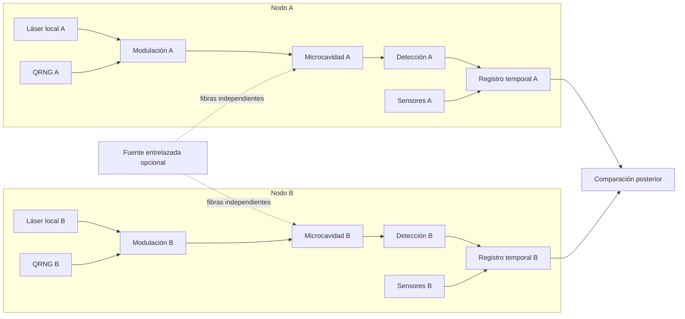

# 4. Laboratorio de metaestados ópticos

## 4.1 Propósito del laboratorio

El laboratorio propuesto debe permitir estudiar transiciones metaestables ópticas con una trazabilidad suficiente para distinguir ruido local, causas comunes, retroacción de medida y correlaciones cuánticas preparadas. La arquitectura se basa en dos nodos físicamente independientes capaces de iniciar cada ensayo desde un estado aproximadamente simétrico, cruzar una bifurcación hacia dos atractores y registrar el resultado con resolución temporal adecuada.

Cada nodo debe poder variar localmente el Hamiltoniano efectivo o la base de medida, conservar un historial completo de configuración y operar tanto con entradas separables como con entradas entrelazadas. La independencia no se limita a la distancia física: incluye láseres, relojes, electrónica, alimentación, generadores aleatorios y software de control separados durante los ensayos críticos.

La plataforma recomendada para la primera implementación es una microcavidad polaritónica. Este sistema combina lectura óptica rápida con interacciones suficientemente intensas para producir biestabilidad, ruptura de simetría y atractores disipativos. Una alternativa con mayor acceso al régimen de pocos cuantos, aunque con más complejidad instrumental, es un medio de polaritones de Rydberg.

## 4.2 Razones para utilizar polaritones

Los fotones se transportan y detectan con facilidad, pero interactúan débilmente entre sí. Los grados de libertad materiales proporcionan interacción y no linealidad, aunque están más expuestos al entorno. Un polaritón combina ambas características: conserva una componente fotónica que permite leer fase, polarización y propagación, y una componente material que introduce masa efectiva, interacción y dinámica no lineal.

La naturaleza abierta y disipativa del sistema no es un defecto accidental. Es precisamente lo que permite la aparición de atractores, dominios, vórtices, biestabilidad y ruptura espontánea de simetría. El laboratorio no estudia «luz pura», sino un sistema híbrido en el que una excitación óptica puede convertirse en una configuración metaestable robusta.

## 4.3 Arquitectura de dos nodos

Cada nodo contiene un láser local, un sistema independiente de modulación, un generador cuántico o físico de números aleatorios, una microcavidad, detectores, sensores ambientales y un registrador temporal. Los datos de A y B se comparan únicamente después de finalizar el bloque experimental.

Durante los experimentos de independencia y no señalización no debe existir un enlace activo entre los controladores. Los relojes pueden disciplinarse antes del ensayo, pero la alineación final se reconstruirá después con una incertidumbre explícita. La fuente entrelazada solo se conecta en los experimentos E10 y E11.

## 4.4 Fuente, control y modulación

Cada nodo necesita un láser pulsado de femtosegundos o picosegundos, con oscilador y electrónica de disparo propios. Los moduladores electroópticos permiten seleccionar base, fase o polarización, mientras que los moduladores acustoópticos controlan amplitud y ventanas de bombeo. La estabilización de frecuencia debe ser local durante la ventana de localidad; una referencia compartida activa podría introducir una causa común.

Los aisladores ópticos y los monitores de retroreflexión son esenciales para detectar realimentación no deseada. La energía, el espectro, la fase y la polarización de cada pulso deben registrarse o muestrearse con suficiente frecuencia para reconstruir su contribución al resultado.

## 4.5 Dispositivo metaestable

La opción prioritaria es una microcavidad semiconductora de alta calidad con pozos cuánticos o un material excitónico adecuado. El dispositivo puede requerir un criostato de ciclo cerrado y un control fino del detuning mediante temperatura o actuadores piezoeléctricos. La geometría debe admitir dos estados aproximadamente degenerados, como polarizaciones circulares opuestas, vórtices de signo contrario o dos modos espaciales equivalentes.

La alternativa basada en Rydberg utiliza una nube atómica fría bajo transparencia electromagnéticamente inducida, con excitaciones de Rydberg que generan interacción fotón–fotón. Esta plataforma ofrece un acceso más limpio a la dinámica cuántica de pocos cuantos, pero exige vacío, enfriamiento, estabilización láser y control atómico más complejos.

## 4.6 Detección y reconstrucción temporal

La detección debe combinar varias modalidades. Los SNSPD o detectores equivalentes proporcionan conteo con bajo jitter; los fotodiodos balanceados permiten medidas homodinas o heterodinas; la interferometría ultrarrápida y las cámaras de streak pueden observar la formación espacial de dominios. El espectrómetro y la polarimetría caracterizan la rama seleccionada, mientras que un registrador temporal común dentro de cada nodo asocia todos los canales al mismo ensayo.

La resolución del sistema de time tagging debe ser mejor que la incertidumbre permitida para el instante de compromiso. También debe existir una rama independiente que mida la energía de cada pulso, porque una diferencia de bombeo puede seleccionar el estado antes de que actúe el mecanismo investigado.

## 4.7 Metrología ambiental

Cada nodo debe registrar temperatura de cavidad y bancada, vibración triaxial, acústica, campos eléctricos y magnéticos, radiofrecuencia de banda ancha, presión, humedad o vacío y radiación ionizante cuando sea relevante. También se conservará el estado de criocoolers, bombas, fuentes y electrónica.

Estos datos no se almacenan como decoración. Cada canal debe tener calibración, frecuencia de muestreo, resolución, incertidumbre y relación temporal con el ensayo. Los hashes de firmware, configuración y código forman parte de la metrología porque un cambio de software puede introducir una correlación tan real como una perturbación física.

## 4.8 Independencia física

La independencia se construye y se verifica. Los nodos utilizarán alimentación separada o aislamiento caracterizado, láseres distintos, relojes propios, QRNG independientes y controladores sin red común durante las ventanas críticas. El blindaje electromagnético debe medirse; no puede asumirse que una jaula o una distancia determinada eliminan todo acoplamiento.

La separación espacial deberá ser suficiente para que la elección local y el evento físico que fija el resultado sean espacialmente separados cuando el protocolo lo requiera. La distancia por sí sola no basta si la decisión real ocurre antes de la elección o si una referencia común continúa actuando sobre ambos nodos.

## 4.9 Ciclo experimental

Cada ensayo comienza con un reinicio suficientemente largo para eliminar excitaciones, calentamiento y carga residual. Después se prepara el detuning, el bombeo y la simetría inicial. La configuración local se elige mediante el generador aleatorio después del último punto causal común permitido.

Un pulso de quench cruza la bifurcación y el sistema evoluciona hasta que aparece un dominio o atractor estable. La lectura puede realizarse con una sonda débil o de forma destructiva después de la transición. El registro se sella localmente mediante escritura append-only y hash encadenado. La comparación entre nodos se realiza únicamente una vez cerrado el bloque.

## 4.10 Instante físico de compromiso

La señal visible en el detector puede aparecer después de que el sistema haya dejado de poder cambiar de rama. Por ello, el instante de lectura no debe identificarse automáticamente con el instante de resultado.

La ventana de compromiso se estimará mediante medidas pump–probe, variación controlada del tiempo de lectura, simulaciones estocásticas calibradas y perturbaciones aplicadas en distintos momentos. Un criterio operacional útil es el instante a partir del cual una perturbación pequeña ya no modifica el atractor final con una probabilidad apreciable. La ventana de localidad debe cubrir desde la elección del ajuste hasta ese punto, incluyendo un margen de ingeniería.

## 4.11 Elección del metaestado

La polarización circular ofrece lectura rápida, aunque una anisotropía residual puede sesgar la distribución. La fase `0/π` es natural en osciladores paramétricos, pero requiere una referencia de fase bien controlada. Los vórtices proporcionan una variable topológica robusta, aunque su lectura espacial es más lenta. Los modos espaciales A/B simplifican la detección, pero son sensibles al desorden de la cavidad. La biestabilidad de intensidad es accesible, aunque suele introducir asimetría y memoria.

Para una prueba de Bell conviene una salida binaria con eficiencia cercana a uno. Para estudiar nucleación y formación de dominios, una imagen espacial completa puede contener más información, aunque complique el cierre de localidad y el análisis de detección.

## 4.12 Software, datos e integridad

El control crítico debe ejecutarse en FPGA o hardware determinista. Cada ensayo se almacenará como un evento inmutable con relojes monotónicos y una relación reconstruible con UTC. Los datos brutos, las calibraciones y los datos derivados se mantendrán separados, y los metadatos de configuración permanecerán versionados.

El análisis confirmatorio se ejecutará en un entorno reproducible y preregistrado. Siempre que sea posible, el equipo que adquiere los datos y el que realiza el análisis ciego serán distintos. El formato mínimo de evento se define en `docs/11_contrato_de_datos.md`.

## 4.13 Programa de validación

La fase L0 utiliza un solo nodo y demuestra la existencia de dos atractores, un reinicio fiable y una distribución estable. El resultado esperado es encontrar sesgos locales, memoria y deriva medibles.

La fase L1 incorpora dos nodos independientes. Su finalidad es demostrar que la correlación residual es compatible con cero después de controlar variables locales y causas comunes. En esta etapa todavía no se interpreta ninguna correlación como una prueba de Bell.

La fase L2 introduce una fuente entrelazada y mide la fidelidad con la que el resultado microscópico se amplifica hasta el metaestado. La fase L3 utiliza la salida metaestable directamente en un protocolo de Bell con control de localidad, detección y memoria. La fase L4 retira la fuente común y ejecuta la búsqueda exploratoria de no localidad espontánea y no señalización bajo preregistro y auditoría externa.

## 4.14 Riesgos técnicos dominantes

El bloqueo por inyección puede hacer que el láser seleccione el estado antes que la bifurcación. Una anisotropía pequeña puede convertir una degeneración aparente en un sistema sesgado. La memoria térmica, excitónica o de carga puede enlazar ensayos consecutivos. Las pérdidas dependientes del estado pueden fabricar una violación mediante postselección, y un reloj común puede generar correlación clásica.

También existe el riesgo de definir el resultado demasiado tarde, de modo que la separación espacial quede invalidada. La deriva puede transformar el orden temporal en una variable oculta. Finalmente, un error de signo, indexado o emparejamiento en el código puede producir una aparente anomalía perfectamente reproducible. Por eso la auditoría de software forma parte del experimento y no es una tarea administrativa posterior.
