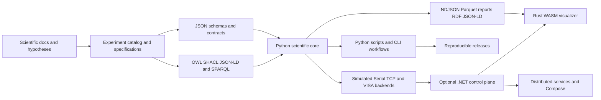

# Architecture and contribution map

MNS is a reproducibility platform, not a single simulation package. Scientific definitions flow into executable specifications, validated data contracts, runtime artifacts and reviewable outputs. The optional .NET and Rust/WASM layers operate around that scientific source of truth; they do not replace it.

## Repository areas

| Area | Responsibility | Good first boundaries |
|---|---|---|
| `docs/`, `experiments/` | Scientific definitions, protocols, gates and references | Clarify one term, repair one link, improve one example |
| `schemas/`, `contracts/`, `ontology/` | Machine-verifiable data meaning and provenance | Add one valid/invalid fixture or improve one diagnostic |
| `src/metastable_suite/` | Models, analysis, execution and artifact generation | Add a regression test before changing behaviour |
| `scripts/` | User-facing reproducible commands | Improve validation, errors or deterministic examples |
| `tests/` | Mathematical, semantic, hardware and release checks | Add one focused failure case with a clear expected result |
| `dotnet/`, `services/` | Optional orchestration and durable operational state | Test one CLI or fail-closed capability boundary |
| `visualizer/` | Provenance-preserving Rust/WASM scene validation and rendering | Add deterministic fixtures or contract-focused tests |
| `.github/` | CI, release, security and contributor workflow | Improve one workflow without weakening required checks |

## Source-of-truth rules

1. Scientific claims and gates are defined in documentation, experiment specifications and linked issues.
2. Schemas and semantic constraints define what artifacts may claim.
3. Runtime services coordinate work but must not silently reinterpret scientific data.
4. Visualization must preserve the distinction between measured, derived, inferred and illustrative content.
5. CI establishes internal consistency, not experimental truth, independent review or replication.

## How to choose a change

Start from one issue and identify the narrowest layer that can satisfy its acceptance criteria. Avoid editing several languages merely because the repository contains them. Cross-layer changes should state the contract that connects the layers and add a regression test at that boundary.

For a guided entry point, read [`ONBOARDING.md`](../ONBOARDING.md) or comment on [issue #93](https://github.com/Papishushi/metastable-nucleation-suite/issues/93). Governance, dependencies and active work are tracked in issue #72.